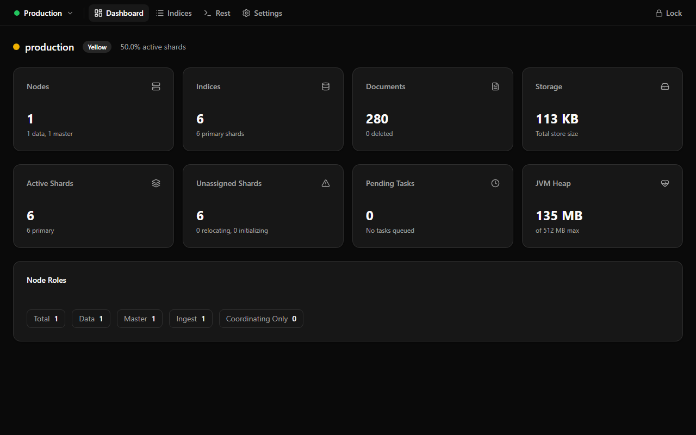
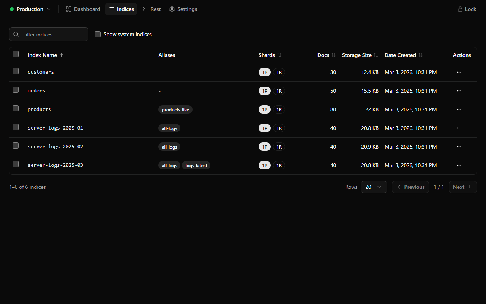
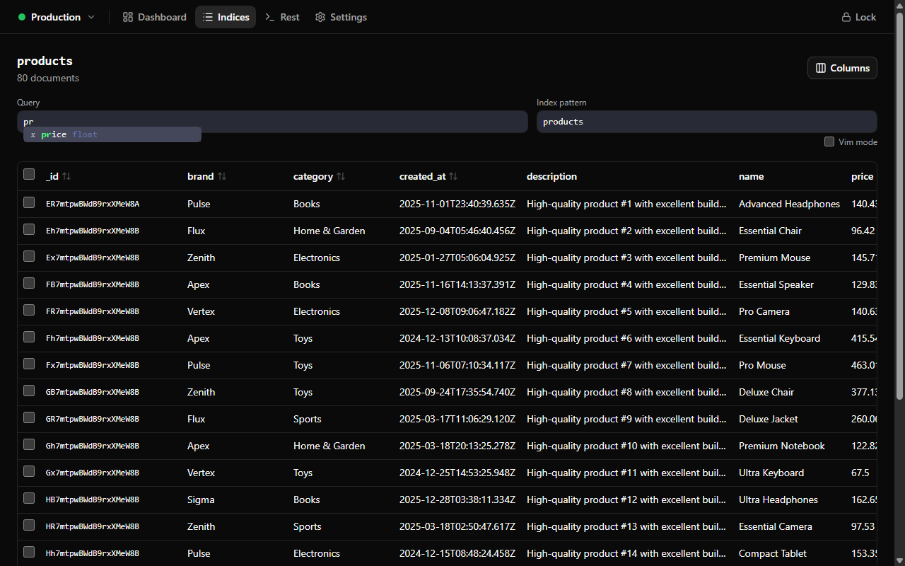
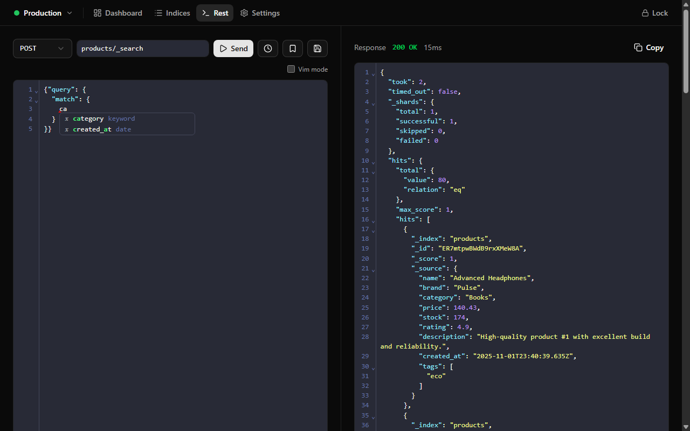
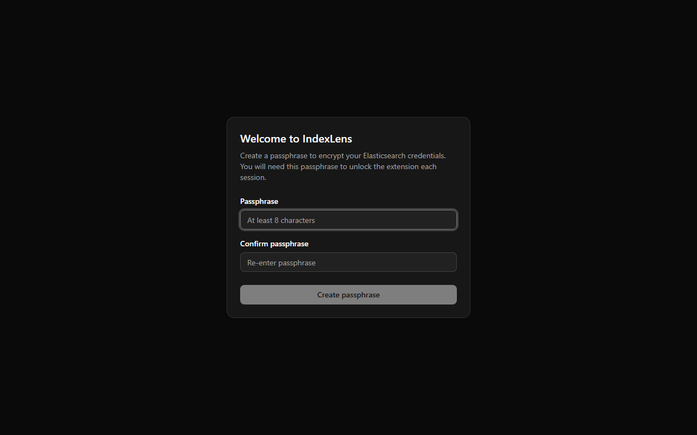
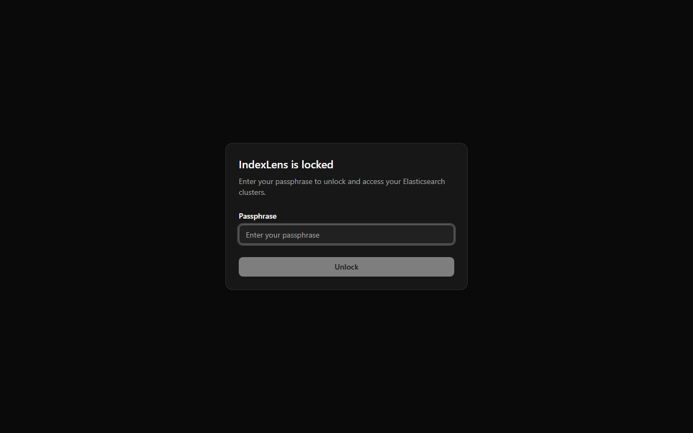

# IndexLens

A Chrome extension for exploring Elasticsearch clusters with encrypted credential storage. Browse indices, inspect documents, and run queries — all without leaving your browser.

## Features

- **Scout search** — Press `Ctrl+Space` to open a scout-style command palette. Search across pages, indices, aliases, and saved queries instantly.
- **Keyboard-driven navigation** — Cycle between Dashboard, Indices, REST Console, and Settings pages with `Shift+T`. Lock the session with `Ctrl+L`.
- **REST Console with intelligent autocomplete** — A full-featured REST client with endpoint autocomplete (index names, ES operations), request body autocomplete (Elasticsearch DSL keywords and field names from index mappings), request history, and saved queries. CodeMirror editors include auto-indentation, bracket matching, and close-bracket completion.
- **Index & document browser** — View all indices in a cluster, drill into an index to browse its documents, view field mappings, and search with custom queries. The column visibility dropdown includes Select All / Deselect All buttons for quick toggling.
- **Encrypted credential vault** — Cluster configurations and credentials are encrypted at rest using AES-256-GCM with a passphrase-derived key. Your passphrase is never stored. See [Security Model](#security-model) for details.
- **Idle auto-lock** — The session automatically locks after 5 minutes of inactivity, wiping the derived key from memory.
- **Vim mode** — All CodeMirror editors (REST console endpoint/body, document query editor, index pattern editor) support optional vim keybindings. Toggle vim mode from the checkbox above the REST console or from the Settings page. The setting persists globally across sessions.
- **Smart HTTP method selection** — The REST console automatically selects the appropriate HTTP method (GET or POST) based on the endpoint action. For example, `_search` auto-selects POST while `_cat/indices` auto-selects GET.
- **Dynamic browser tab title** — The browser tab title updates dynamically to show "IndexLens | &lt;cluster name&gt;" based on the active cluster.
- **Settings & config import/export** — Export your full IndexLens configuration (clusters and saved queries) as an encrypted JSON file using an export passphrase, and re-import it later with that same passphrase. Migrate from Elasticvue by importing its backup file — cluster connections and saved queries are mapped automatically. Duplicate clusters and queries are detected and skipped during import.

## Screenshots

### Dashboard


### Indices


### Documents


### REST Console


### Scout Search


### Setup Screen


### Lock Screen


## Getting Started

### Prerequisites

- Node.js 20+
- npm

### Install & Build

```bash
npm install
npm run build:extension
```

`npm run build:extension` generates `dist/` and writes `dist/manifest.json` with:
- `manifest_version: 3` (validated from `public/manifest.json`)
- `version` sourced from `package.json` (or `EXTENSION_VERSION` if explicitly provided)

### Load in Chrome

1. Run `npm run build:extension` to produce the `dist/` folder.
2. Open `chrome://extensions` and enable **Developer mode**.
3. Click **Load unpacked** and select the `dist/` directory.
4. Click the IndexLens toolbar icon to open the extension in a new tab (or focus an existing one).

### Branding Assets

- Editable source icon: `docs/assets/indexlens-icon-source.svg`
- Generated runtime assets (copied to `dist/` by Vite): `public/indexlens-favicon.svg` and `public/indexlens-icon-{16,32,48,128}.png`
- Regenerate PNG/icon assets from source:
  ```bash
  python3 scripts/generate-icons.py
  ```

### Development Server

```bash
npm run dev
```

> **Note:** The dev server is useful for iterating on UI, but `chrome.runtime` APIs (messaging, storage, ports) only work when loaded as an unpacked extension.

## Hotkeys

| Shortcut | Action | Context |
|---|---|---|
| `Ctrl+Space` | Toggle Scout search | Anywhere while unlocked |
| `Ctrl+L` | Lock the session | Anywhere while unlocked |
| `Shift+T` | Cycle to the next page (Dashboard / Indices / REST / Settings) | When focus is not in a text input |
| `Enter` | Execute request (endpoint editor) | REST Console endpoint field |
| `Ctrl+Enter` | Execute request (body editor) | REST Console body editor |
| `Tab` | Accept or trigger autocomplete | REST Console editors |
| `Tab` | Move focus from endpoint editor to body editor | REST Console endpoint field (when endpoint has a terminal action) |

## Security Model

IndexLens encrypts all cluster configurations and credentials at rest using a passphrase-derived key. The passphrase itself is **never stored** — not in `chrome.storage.local`, not on disk, nowhere.

### How It Works

1. **Passphrase setup** — On first launch the user creates a passphrase (minimum 8 characters). A random 16-byte salt is generated and used with PBKDF2 (600,000 iterations, SHA-256) to derive an AES-256-GCM key. A known verifier string is encrypted with that key and stored alongside the salt in `chrome.storage.local` so future unlocks can validate the passphrase without persisting it.

2. **Unlock** — On subsequent sessions the user enters their passphrase. The extension re-derives the key from the stored salt via PBKDF2 and attempts to decrypt the verifier. If decryption succeeds and the plaintext matches, the session is unlocked and the derived `CryptoKey` is held in the service worker's memory.

3. **Credential storage** — Each credential is encrypted with AES-256-GCM using a unique random 12-byte IV and stored in `chrome.storage.local`. Credentials can only be read, written, or deleted while the session is unlocked. All credential operations return an explicit "Locked" error when the key is not available.

4. **Idle auto-lock** — A configurable inactivity timeout (default: 5 minutes) automatically wipes the derived key from memory and locks the session. The timeout resets on meaningful user activity (key presses, mouse clicks, window focus) forwarded from the page over a long-lived port to the background service worker.

### Key Design Decisions

- **WebCrypto only** — All cryptographic operations use the browser's native `crypto.subtle` API. No third-party crypto libraries are included.
- **PBKDF2 with 600,000 iterations** — Provides brute-force resistance for the passphrase derivation step.
- **AES-256-GCM** — Authenticated encryption ensures both confidentiality and integrity of stored credentials.
- **In-memory key** — The derived `CryptoKey` lives only in the service worker's memory and is never serialised or written to storage. It is cleared on lock.
- **Versioned payloads** — Every encrypted envelope carries a version tag for future migration support.

## Development

### Versioning Source of Truth

- `package.json` `version` is the canonical extension version.
- `public/manifest.json` is the MV3 metadata template and intentionally does not carry a fixed `version`.
- During build, Vite generates `dist/manifest.json` and injects the resolved version.
- Optional CI override: set `EXTENSION_VERSION` to a valid Chrome-extension version string (1-4 numeric parts, each `0-65535`).

### Local Release Packaging

```bash
npm run package:extension
```

This runs `build:extension` and then creates a deterministic zip at:
- `artifacts/indexlens-vX.Y.Z.zip`

The zip includes runtime files from `dist/` only and is suitable for extension distribution.

### Regenerating Screenshots

Screenshots in `docs/screenshots/` are captured automatically via Playwright against local Elasticsearch clusters.

```bash
npm run build                       # build the extension
docker compose up -d                # start ES clusters
node scripts/seed-clusters.mjs      # populate sample data
npx tsx scripts/take-screenshots.mts  # capture screenshots
docker compose down                 # clean up
```

### Lint & Type-Check

```bash
npm run lint
npm run build:extension   # runs tsc -b before vite build
```

### Unit Tests

```bash
npm run test
```

### E2E Tests (Playwright)

The project includes Playwright-based end-to-end tests that load the built extension into a real Chromium instance.

#### Prerequisites

1. Build the extension first — tests load from `dist/`:
   ```bash
   npm run build:extension
   ```
2. Install Playwright browsers (one-time):
   ```bash
   npx playwright install chromium
   ```
3. On Linux, install the required system libraries:
   ```bash
   npx playwright install-deps chromium
   ```

#### Running Tests

```bash
npm run test:e2e           # default (headed, required for extensions)
npm run test:e2e:headed    # explicit headed mode
```

Chrome extensions cannot run in headless mode, so all E2E tests launch a visible Chromium window. In CI environments, use `xvfb-run` or a similar virtual framebuffer:

```bash
xvfb-run npm run test:e2e
```

## CI and Releases

GitHub Actions workflow: `.github/workflows/extension-build.yml`

- On pull requests and pushes, CI runs:
  1. `npm ci`
  2. `npm run lint`
  3. `npm run test` (unit tests)
  4. `npm run package:extension`
  5. Upload `artifacts/*.zip` as a workflow artifact
- On semantic version tags (`v*`), the same workflow also publishes the zip to a GitHub Release via `softprops/action-gh-release`.

### Version Bump and Release Flow

1. Update `package.json` version (for example via `npm version patch|minor|major`).
2. Run `npm run package:extension` locally to verify packaging output.
3. Push your changes and create/push a matching version tag like `v1.2.3`.
4. Download the release zip from either:
   - GitHub Actions run artifacts (all runs), or
   - GitHub Release assets (tagged `v*` runs).

### Troubleshooting

- Version mismatch/build failure:
  - Ensure `package.json` version is a valid extension version (`1`, `1.2`, `1.2.3`, or `1.2.3.4` with each part `0-65535`).
  - If using `EXTENSION_VERSION`, ensure it is valid and intended.
- Missing `dist/` when packaging:
  - Run `npm run build:extension` or use `npm run package:extension` (which builds first).
- Invalid `manifest_version` error:
  - Confirm `public/manifest.json` contains `"manifest_version": 3`.
- Workflow artifact not found:
  - Confirm `npm run package:extension` completed in CI and inspect the `Upload extension zip artifact` step logs.

## Project Structure

```
src/
  extension/
    background.ts   - Service worker: lock state, messaging, idle timer, toolbar action
    types.ts        - Typed message contracts (page <-> background)
  security/
    constants.ts    - Crypto & storage constants, default timeout
    crypto.ts       - WebCrypto primitives (PBKDF2, AES-GCM)
    storage.ts      - chrome.storage.local wrapper
  page/
    lock-state.ts   - Page-side state types, passphrase validation
    use-lock-session.ts - React hook for lock lifecycle & activity heartbeat
    setup-screen.tsx    - First-run passphrase creation UI
    lock-screen.tsx     - Locked passphrase entry UI
    unlocked-shell.tsx  - Unlocked application shell
  lib/
    config-transfer.ts  - Import/export logic for IndexLens and Elasticvue configs
    es-endpoint-method.ts - Smart HTTP method inference from endpoint path
    global-settings.ts  - Global UI settings (vim mode) persisted in localStorage
  components/
    scout-search.tsx - Scout command palette (Ctrl+Space)
    rest-page.tsx        - REST console with autocomplete and history
    query-editor.tsx     - Reusable CodeMirror query editor with vim support
    index-pattern-editor.tsx - Index pattern autocomplete editor
    indices-page.tsx     - Index browser
    documents-page.tsx   - Document viewer
    dashboard-page.tsx   - Cluster dashboard
    settings-page.tsx    - Settings: config export, import, Elasticvue migration
    navbar.tsx           - Navigation bar
  App.tsx           - Root component routing between lock states
  main.tsx          - React entry point
tests/
  fixtures.ts       - Playwright fixtures: persistent context, extension ID, page
  extension.spec.ts - E2E tests for lock flow, setup, and toolbar behavior
```

## License

This project is not yet published under a specific license.
