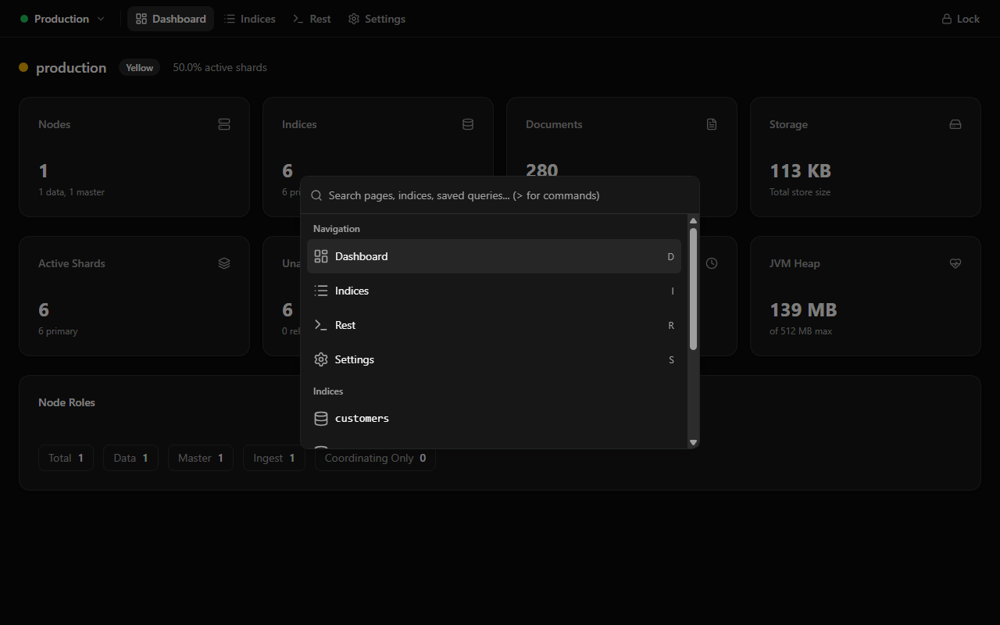

# IndexLens

A Chrome extension for exploring Elasticsearch clusters with encrypted credential storage. Browse indices, inspect documents, and run queries — all without leaving your browser.

## Features

- **Spotlight search** — Press `Ctrl+Space` to open a spotlight-style command palette. Search across pages, indices, aliases, and saved queries instantly.
- **Keyboard-driven navigation** — Cycle between Dashboard, Indices, and REST Console pages with `Shift+T`. Lock the session with `Ctrl+L`.
- **REST Console with intelligent autocomplete** — A full-featured REST client with endpoint autocomplete (index names, ES operations), request body autocomplete (Elasticsearch DSL keywords and field names from index mappings), request history, and saved queries.
- **Index & document browser** — View all indices in a cluster, drill into an index to browse its documents, view field mappings, and search with custom queries.
- **Encrypted credential vault** — Cluster configurations and credentials are encrypted at rest using AES-256-GCM with a passphrase-derived key. Your passphrase is never stored. See [Security Model](#security-model) for details.
- **Idle auto-lock** — The session automatically locks after 5 minutes of inactivity, wiping the derived key from memory.

## Screenshots

<!-- Replace each placeholder with an actual screenshot -->

### Setup Screen
<!--  -->
`TODO: Add screenshot of the first-run passphrase setup screen`

### Lock Screen
<!--  -->
`TODO: Add screenshot of the lock/unlock screen`

### Dashboard
<!--  -->
`TODO: Add screenshot of the cluster dashboard overview`

### Spotlight Search
<!--  -->
`TODO: Add screenshot of the spotlight command palette (Ctrl+Space)`

### Indices & Documents
<!--  -->
`TODO: Add screenshot of the indices list and document browser`

### REST Console
<!--  -->
`TODO: Add screenshot of the REST console with autocomplete visible`

## Getting Started

### Prerequisites

- Node.js 20+
- npm

### Install & Build

```bash
npm install
npm run build
```

### Load in Chrome

1. Run `npm run build` to produce the `dist/` folder.
2. Open `chrome://extensions` and enable **Developer mode**.
3. Click **Load unpacked** and select the `dist/` directory.
4. Click the IndexLens toolbar icon to open the extension in a new tab (or focus an existing one).

### Development Server

```bash
npm run dev
```

> **Note:** The dev server is useful for iterating on UI, but `chrome.runtime` APIs (messaging, storage, ports) only work when loaded as an unpacked extension.

## Hotkeys

| Shortcut | Action | Context |
|---|---|---|
| `Ctrl+Space` | Toggle spotlight search | Anywhere while unlocked |
| `Ctrl+L` | Lock the session | Anywhere while unlocked |
| `Shift+T` | Cycle to the next page (Dashboard / Indices / REST) | When focus is not in a text input |
| `Enter` | Execute request (endpoint editor) | REST Console endpoint field |
| `Ctrl+Enter` | Execute request (body editor) | REST Console body editor |
| `Tab` | Accept or trigger autocomplete | REST Console editors |

## Security Model

IndexLens encrypts all cluster configurations and credentials at rest using a passphrase-derived key. The passphrase itself is **never stored** — not in `chrome.storage.local`, not on disk, nowhere.

### How It Works

1. **Passphrase setup** — On first launch the user creates a passphrase (minimum 8 characters). A random 16-byte salt is generated and used with PBKDF2 (600,000 iterations, SHA-256) to derive an AES-256-GCM key. A known verifier string is encrypted with that key and stored alongside the salt in `chrome.storage.local` so future unlocks can validate the passphrase without persisting it.

2. **Unlock** — On subsequent sessions the user enters their passphrase. The extension re-derives the key from the stored salt via PBKDF2 and attempts to decrypt the verifier. If decryption succeeds and the plaintext matches, the session is unlocked and the derived `CryptoKey` is held in the service worker's memory.

3. **Credential storage** — Each credential is encrypted with AES-256-GCM using a unique random 12-byte IV and stored in `chrome.storage.local`. Credentials can only be read, written, or deleted while the session is unlocked. All credential operations return an explicit "Locked" error when the key is not available.

4. **Idle auto-lock** — A configurable inactivity timeout (default: 5 minutes) automatically wipes the derived key from memory and locks the session. The timeout resets on meaningful user activity (key presses, mouse clicks, window focus) forwarded from the page over a long-lived port to the background service worker.

### Key Design Decisions

- **WebCrypto only** — All cryptographic operations use the browser's native `crypto.subtle` API. No third-party crypto libraries are included.
- **PBKDF2 with 600,000 iterations** — Provides brute-force resistance for the passphrase derivation step.
- **AES-256-GCM** — Authenticated encryption ensures both confidentiality and integrity of stored credentials.
- **In-memory key** — The derived `CryptoKey` lives only in the service worker's memory and is never serialised or written to storage. It is cleared on lock.
- **Versioned payloads** — Every encrypted envelope carries a version tag for future migration support.

## Development

### Lint & Type-Check

```bash
npm run lint
npm run build   # runs tsc -b before vite build
```

### Unit Tests

```bash
npm run test
```

### E2E Tests (Playwright)

The project includes Playwright-based end-to-end tests that load the built extension into a real Chromium instance.

#### Prerequisites

1. Build the extension first — tests load from `dist/`:
   ```bash
   npm run build
   ```
2. Install Playwright browsers (one-time):
   ```bash
   npx playwright install chromium
   ```
3. On Linux, install the required system libraries:
   ```bash
   npx playwright install-deps chromium
   ```

#### Running Tests

```bash
npm run test:e2e           # default (headed, required for extensions)
npm run test:e2e:headed    # explicit headed mode
```

Chrome extensions cannot run in headless mode, so all E2E tests launch a visible Chromium window. In CI environments, use `xvfb-run` or a similar virtual framebuffer:

```bash
xvfb-run npm run test:e2e
```

## Project Structure

```
src/
  extension/
    background.ts   - Service worker: lock state, messaging, idle timer, toolbar action
    types.ts        - Typed message contracts (page <-> background)
  security/
    constants.ts    - Crypto & storage constants, default timeout
    crypto.ts       - WebCrypto primitives (PBKDF2, AES-GCM)
    storage.ts      - chrome.storage.local wrapper
  page/
    lock-state.ts   - Page-side state types, passphrase validation
    use-lock-session.ts - React hook for lock lifecycle & activity heartbeat
    setup-screen.tsx    - First-run passphrase creation UI
    lock-screen.tsx     - Locked passphrase entry UI
    unlocked-shell.tsx  - Unlocked application shell
  components/
    spotlight-search.tsx - Spotlight command palette (Ctrl+Space)
    rest-page.tsx        - REST console with autocomplete and history
    indices-page.tsx     - Index browser
    documents-page.tsx   - Document viewer
    dashboard-page.tsx   - Cluster dashboard
    navbar.tsx           - Navigation bar
  App.tsx           - Root component routing between lock states
  main.tsx          - React entry point
tests/
  fixtures.ts       - Playwright fixtures: persistent context, extension ID, page
  extension.spec.ts - E2E tests for lock flow, setup, and toolbar behavior
```

## License

This project is not yet published under a specific license.
